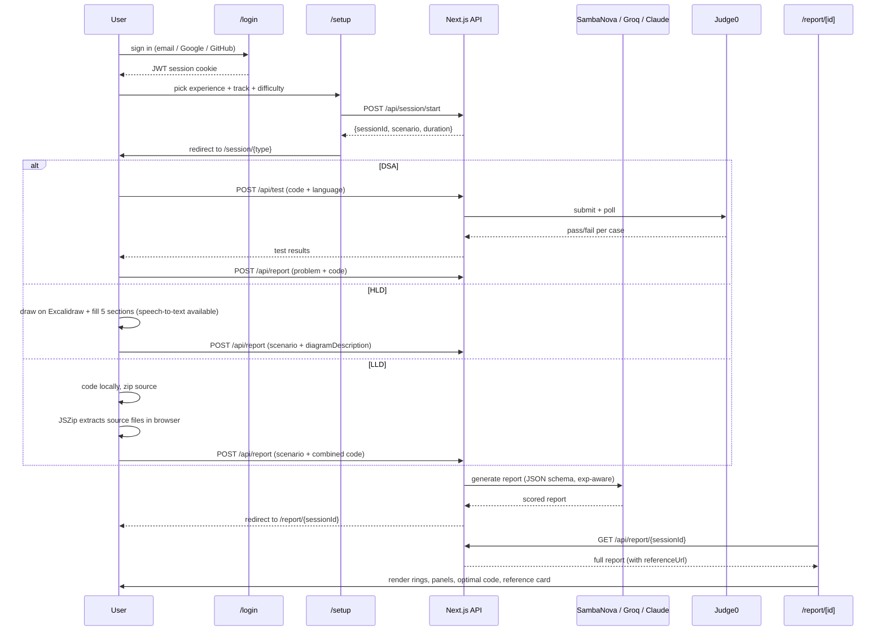

# InterviewFlow

> A serious training ground for staff-bound engineers. Real coding, real system design, real critique — under real time. No flashcards, no fluff, no "ace it in 7 days" promises.

InterviewFlow is an AI-graded SDE interview-prep platform with three timed tracks (DSA, HLD, LLD), a curated problem bank, and a critique pipeline that scores submissions across correctness, clarity, trade-offs, scalability, and code quality.

**Status:** v2 — auth required (email / Google / GitHub). Reports and dashboard are account-bound.

---

## ✦ Features

- **Three tracks**, each with its own pacing and submission format:
  - **DSA** — Monaco editor, four languages (JS / Python / Java / C++), Judge0-executed test cases, compile-only Run, 20–45 min timer
  - **HLD** — Excalidraw canvas + structured 5-section design template + speech-to-text dictation, 45 min timer
  - **LLD** — Local-IDE workflow with `.zip` upload (multi-file repo critique), 60 min timer
- **AI-graded reports** — radial score rings, strengths / issues / improvements / missing, optimal-approach reveal, follow-up questions, similar problems, weak-topic radar, in-report coaching chat
- **Experience-aware grading** — HLD and LLD scoring adapts to the experience level you declared at setup; follow-up questions are included in every report
- **Reference articles** — every report includes a "deep-dive" link to the canonical breakdown (Hello Interview for HLD, WorkAt Tech for LLD, LeetCode for DSA)
- **Dashboard** — per-account view of solved counts per track, easy/medium/hard breakdown, recent attempts, weak-topic radar
- **Difficulty filter** — pick easy / medium / hard for HLD and LLD scenario pools
- **40 + 10 + 124+** — 40 HLD scenarios, 10 LLD scenarios, 124+ DSA problems (includes full Striver SDE sheet)
- **Auth** — email/password (Supabase), Google OAuth, GitHub OAuth; `/dashboard` and `/session/*` are protected routes

---

## ✦ System Architecture

```mermaid
flowchart TB
    subgraph Browser["Browser (Next.js client)"]
        UI["UI<br/>React 19 + Tailwind v4 + shadcn"]
        Monaco["Monaco Editor<br/>(DSA solve)"]
        Excalidraw["Excalidraw<br/>(HLD design)"]
        JSZip["JSZip<br/>(LLD upload)"]
        LS["localStorage<br/>solved · weakness · code"]
        Recharts["Recharts<br/>(score rings, charts)"]
    end

    subgraph NextJS["Next.js API Routes (server)"]
        SS["/api/session/start<br/>scenario picker + filter"]
        SR["/api/session/read<br/>in-mem cache"]
        RC["/api/round/*<br/>DSA round state"]
        REP["/api/report<br/>+ /api/report/[id]"]
        TST["/api/test<br/>code execution proxy"]
        COA["/api/coaching/chat<br/>streaming chat"]
        AUTH["/api/auth/*<br/>NextAuth v5"]
        Cache[("In-memory caches<br/>session · round · report")]
    end

    subgraph External["External services"]
        SambaNova["SambaNova<br/>(Meta-Llama-3.3-70B)<br/>DSA primary grader"]
        Groq["Groq llama-3.3-70b<br/>(DSA fallback + HLD/LLD primary + coaching)"]
        Anthropic["Anthropic Claude<br/>(claude-haiku-4-5)<br/>final fallback grader"]
        Judge0["Judge0 CE API<br/>(JS/Py/Java/C++ exec)"]
        Supabase["Supabase<br/>(auth + user store)"]
    end

    subgraph Data["Static data (committed)"]
        Bank["DSA knowledge bank<br/>(124+ problems incl. Striver SDE)"]
        HLD["HLD prompts<br/>(40 scenarios)"]
        LLD["LLD prompts<br/>(10 scenarios)"]
        Refs["Reference URLs<br/>Hello Interview · WorkAt Tech · LeetCode"]
    end

    UI -->|fetch| SS & SR & RC & REP & TST & COA & AUTH
    SS & SR & RC & REP --> Cache
    SS --> Bank & HLD & LLD
    REP -->|DSA primary| SambaNova
    REP -->|DSA fallback / HLD+LLD primary| Groq
    REP -->|final fallback| Anthropic
    COA --> Groq
    TST --> Judge0
    AUTH --> Supabase
    REP -->|attaches| Refs
    UI <--> LS
    UI <--> Monaco & Excalidraw & JSZip & Recharts
```



### AI routing per track

| Track | Primary | Fallback 1 | Fallback 2 |
|---|---|---|---|
| **DSA** | SambaNova (Meta-Llama-3.3-70B) | Groq | Claude Haiku |
| **HLD** | Groq | Claude Haiku | — |
| **LLD** | Groq | Claude Haiku | — |
| **Coaching chat** | Groq streaming | — | — |

Separating DSA traffic onto SambaNova prevents it from competing with HLD/LLD for the Groq rate-limit budget.

### Request flow per track



---

## ✦ Tech Stack

| Layer | Choice | Why |
|---|---|---|
| **Framework** | Next.js 16.2.4 (Turbopack, App Router) | Modern App Router, fast dev, edge-ready API routes |
| **UI** | React 19.2 + Tailwind v4 + shadcn/ui + Lucide | Composable primitives, dark-mode polish |
| **Charts** | Recharts | Animated radial score rings + bar charts |
| **Editors** | Monaco (DSA), Excalidraw (HLD) | Premium tooling feel; both lazy-loaded |
| **Archive** | JSZip (browser) | Multi-file LLD submissions parsed client-side |
| **Auth** | NextAuth v5 + Supabase | Edge-safe middleware; credentials + Google + GitHub OAuth |
| **AI — DSA** | SambaNova (`Meta-Llama-3.3-70B-Instruct`) primary → Groq fallback → Claude fallback | Dedicated pool for DSA; avoids rate-limit contention with HLD/LLD |
| **AI — HLD/LLD** | Groq (`llama-3.3-70b-versatile`) → Claude (`claude-haiku-4-5-20251001`) fallback | Strict JSON-schema output for report shape |
| **AI — Coaching** | Groq streaming | Low-latency in-report chat |
| **Code exec** | Judge0 CE (`https://ce.judge0.com`) | Sandboxed JS / Python / Java / C++ |
| **Persistence** | Supabase (auth/user) + localStorage (solved history) + in-memory cache (session/report) | Auth is server-side; analytics remain client-side for now |

---

## ✦ Project Structure

```
src/
├── app/
│   ├── page.tsx                # Landing
│   ├── login/                  # Login page + form (credentials / Google / GitHub)
│   ├── signup/                 # Signup page + form (email + password via Supabase)
│   ├── setup/page.tsx          # Session config (track + experience + difficulty)
│   ├── dashboard/page.tsx      # Solved counts + weak topics (3 track blocks) — auth-protected
│   ├── session/
│   │   ├── dsa/round/page.tsx  # DSA round overview
│   │   ├── dsa/solve/page.tsx  # Monaco editor + Judge0 tests + compile-only Run
│   │   ├── hld/read/page.tsx   # HLD problem + hints
│   │   ├── hld/design/page.tsx # Excalidraw canvas + 5-section template + speech-to-text
│   │   ├── lld/read/page.tsx   # LLD problem + guidelines
│   │   └── lld/solve/page.tsx  # Zip upload + extraction
│   ├── report/[sessionId]/page.tsx  # AI-graded report
│   └── api/
│       ├── auth/[...nextauth]    # NextAuth v5 handler
│       ├── auth/signup           # Supabase user creation
│       ├── session/{start,read,complete}
│       ├── round/{create,read,update,report}
│       ├── report/{,[sessionId]}
│       ├── test                  # Judge0 proxy
│       ├── coaching/chat         # Groq streaming
│       └── problems/{batch,daily}
├── auth.ts                       # NextAuth full config (Node — credentials + OAuth)
├── auth.config.ts                # Edge-safe auth config (used by middleware)
├── middleware.ts                 # Route protection (/dashboard + /session require auth)
├── components/
│   ├── session/                  # MonacoEditor, ExcalidrawCanvas, HLDTemplate, TestCasePanel, SessionTimer, ProblemStatement, etc.
│   ├── report/                   # TimeAnalysis · FollowUp · CompanyTags · SimilarProblems · Weakness · Coaching panels
│   └── ui/                       # shadcn primitives (button, card, badge, skeleton, …)
├── lib/
│   ├── sambanova.ts              # SambaNova client (DSA primary grader)
│   ├── groq.ts                   # Groq client (DSA fallback + HLD/LLD primary + coaching stream)
│   ├── claude.ts                 # Anthropic client + DSA/HLD/LLD report builders (final fallback)
│   ├── supabase.ts               # Supabase client helpers
│   ├── session.ts                # HLD_PROMPTS (40) · LLD_PROMPTS (10) · TIMER_CONFIG
│   ├── dsa-knowledge-bank.ts     # Curated DSA bank (124+ problems incl. Striver SDE list)
│   ├── solved-tracker.ts         # localStorage solved history + track derivation
│   ├── weakness-tracker.ts       # localStorage weakness ledger
│   ├── round-cache.ts            # In-memory DSA round state
│   ├── report-cache.ts           # In-memory report cache
│   ├── piston-harness.ts         # Per-language test harness templates
│   ├── problem-stubs.ts          # Per-language code skeletons
│   ├── hld-hints.ts              # Design hints per HLD scenario
│   ├── rag-retrieval.ts          # Similar-problem scoring
│   └── data.ts                   # File-system data helpers
└── types/index.ts                # SessionReport · HLDScenario · LLDScenario · Problem · …
```

---

## ✦ Quick Start

```bash
# 1. Install
npm install

# 2. Configure environment
cp .env.example .env.local
# edit .env.local — see env var table below

# 3. Run dev server
npm run dev
# → http://localhost:3000

# 4. Production build
npm run build
npm start
```

### Environment variables

| Variable | Required | Purpose |
|---|---|---|
| `NEXT_PUBLIC_SUPABASE_URL` | **Yes** | Supabase project URL (auth) |
| `NEXT_PUBLIC_SUPABASE_PUBLISHABLE_KEY` | **Yes** | Supabase anon key |
| `NEXTAUTH_SECRET` | **Yes** | NextAuth JWT signing secret (`openssl rand -base64 32`) |
| `ANTHROPIC_API_KEY` | recommended | Final-fallback AI grader (Claude Haiku 4.5) |
| `GROQ_API_KEY` | recommended | HLD/LLD primary grader + coaching chat stream |
| `SAMBANOVA_API_KEY` | recommended | DSA primary grader (Meta-Llama-3.3-70B via SambaNova) |
| `AUTH_GOOGLE_ID` / `AUTH_GOOGLE_SECRET` | optional | Enable Google OAuth |
| `AUTH_GITHUB_ID` / `AUTH_GITHUB_SECRET` | optional | Enable GitHub OAuth |
| `NEXTAUTH_URL` | optional | Required in production (`https://your-domain`) |
| `CLI_DATA_PATH` | optional | Path to a sibling `interview-prep/` data dir for daily-problem helpers |

If no AI key is set, report generation falls back to a static placeholder so the UI still renders end-to-end.

---

## ✦ Development log (v1 → v2)

What got built getting here, in rough chronological order:

1. **Question bank expansion** — scraped Hello Interview (HLD) and WorkAt Tech (LLD); HLD: 8 → 15 prompts, LLD: 3 → 10 prompts; all labeled `easy` / `medium` / `hard`.
2. **Difficulty filter** — `/api/session/start` accepts `difficulty: string[]`, `/setup` ships a chip-group UI, end-to-end handoff fixed (was being dropped by the `[type]` redirect).
3. **Bug-fix wave** — 8 bugs squashed:
   - missing `generateLLDReport` export (500s on LLD report)
   - `timeTakenMinutes === 0` rejected as missing field
   - HLD form submitted with all-blank fields silently
   - report page crashed on partial / older reports
   - LLD `allocatedMinutes` not rounded
   - cache-miss showed dead-end "Failed to Load"
   - no logging on malformed AI JSON
   - difficulty filter dropped during type-page redirect
4. **Design overhaul** — landing, setup, report (main + score rings + insight cards + time-analysis + follow-up panels) rebuilt to production-grade dark-theme aesthetic with mk-* utility system. Session-flow pages kept original styling for v1 (will iterate after friend feedback).
5. **Reference article links** — every HLD / LLD / DSA scenario carries a `referenceUrl`; the report renders a "Read the reference breakdown" CTA that opens Hello Interview / WorkAt Tech / LeetCode in a new tab.
6. **Dashboard** — `/dashboard` page with 3 track blocks (DSA · HLD · LLD), each showing total solved count + animated easy/medium/hard breakdown bars + recent attempts list. Weak-topic radar, stats strip, empty-state CTA. All driven by localStorage.
7. **HLD expansion** — 25 new cream HLD scenarios (prachub) added + reference articles backfilled for all entries → **40 total HLD scenarios**.
8. **Experience-aware grading** — HLD and LLD prompts now inject problem description + experience level; grading is lenient for junior levels; follow-up questions added to every report.
9. **HLD speech-to-text** — microphone dictation button in the design field modal (Web Speech API).
10. **DSA bank expansion** — Striver SDE sheet ingested (+94 problems); **124+ total DSA problems** with automatic rotation and weak-topic weighting.
11. **SambaNova AI routing** — DSA grading now routes to SambaNova (Meta-Llama-3.3-70B) as primary, with Groq → Claude fallback chain. HLD/LLD stay on Groq → Claude. Separates rate-limit pools so DSA traffic doesn't compete with design-track grading.
12. **DSA compile-only Run** — "Run" button executes against a compile check before the full Judge0 test suite; canonical cases backfilled from LeetCode examples.
13. **Session UX fixes** — scenario preserved on back-nav; "View Problem" button on solve page; eliminated "Failed to load" flash on session open; setup routes directly to sub-pages (skips legacy `[type]` redirect).
14. **Auth — NextAuth v5 + Supabase** — email/password credentials via Supabase `signInWithPassword`; optional Google and GitHub OAuth (conditionally enabled by env vars); middleware enforces auth on `/dashboard` and `/session/*`; dashboard shows user avatar + display name; login + signup pages added.

---

## ✦ Credits

This project leans on excellent published interview content. Reference articles in the report attribute back to the original authors:

- **Hello Interview** — system-design problem breakdowns ([hellointerview.com](https://www.hellointerview.com/learn/system-design/problem-breakdowns/overview))
- **WorkAt Tech** — machine-coding (LLD) problems ([workat.tech/machine-coding](https://workat.tech/machine-coding/practice))
- **LeetCode** — DSA problem statements
- **Striver** — SDE sheet problem curation ([takeuforward.org](https://takeuforward.org/interviews/strivers-sde-sheet-top-coding-interview-problems/))

We curate, time, and AI-grade — but the canonical walkthroughs live with the original authors. If you got value from a problem, follow the link in the report.

---

## ✦ Roadmap (post-v2)

- **Cross-device dashboard** — Supabase Postgres for solved history + weakness ledger (currently localStorage)
- **Behavioral round** — STAR-format prompts with structured grading
- **Full-mock combo** — 90-min back-to-back coding + design + behavioral
- **Mobile responsive pass** — current build is desktop-first
- **Session-flow page redesign** — DSA solve, HLD design, LLD solve UI polish
- **Coaching/Weakness/Similar/CompanyTags panels** — visual polish to match the rest of the report

---

## ✦ License

MIT — see [LICENSE](LICENSE).
